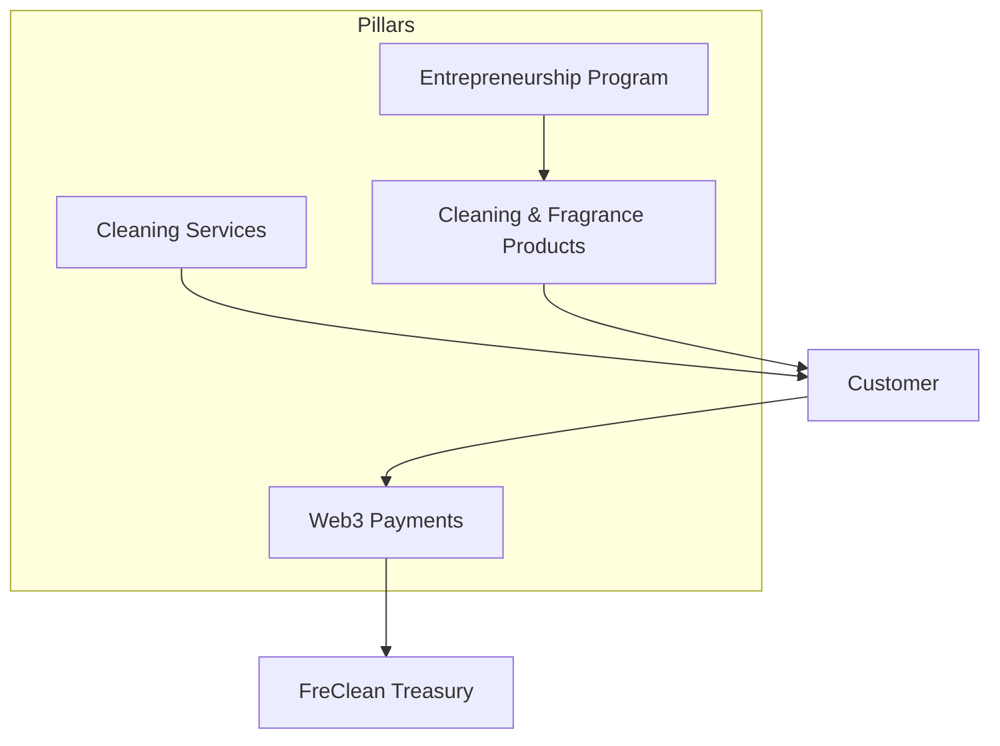

# 03 — Business Model

## Revenue logic

| Pillar | Revenue source | Status |
|---|---|---|
| Cleaning services | Per-booking service fees | Active |
| Products | Direct retail and wholesale sales | In development |
| Entrepreneurship | Wholesale sales to enrolled entrepreneurs | Planned |
| Web3 payments | Not a revenue source itself — a payment rail for the other three | In development |

Web3 payments are explicitly not a fifth revenue pillar; they are infrastructure that makes the other three easier to transact in, particularly for customers or entrepreneurs without reliable access to traditional banking.

## How the pillars reinforce each other

- Cleaning services generate the customer relationships and brand trust that make product sales credible.
- Products give the Entrepreneurship Program something concrete to sell.
- The Entrepreneurship Program extends FreClean's distribution beyond what FreClean's own cleaning teams could reach alone.
- Web3 payments reduce friction across all three, particularly for entrepreneurs and customers who prefer or need a non-cash, non-bank-card option.

## What FreClean is not

FreClean is not a lending platform, not a yield-generating product, not a token, and not an investment vehicle. It is an operating company with four connected, real-world business lines. Any document or communication that frames FreClean otherwise should be corrected to match this model.
