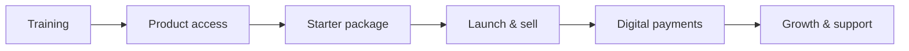

# 06 - Entrepreneurship Model

Full program documentation lives in `freclean-entrepreneurship`. This section summarizes the strategic role the program plays in FreClean's broader model.

## Why FreClean runs an entrepreneurship program

1. **Distribution beyond FreClean's own reach.** Enrolled entrepreneurs sell FreClean products into networks FreClean's own cleaning teams don't directly touch.
2. **Local economic participation.** The program is structured so individuals build their own small businesses on FreClean products, not employment relationships - see the independence principle in `freclean-entrepreneurship/docs/01-program-overview.md`.
3. **A proving ground for Web3 payments among non-crypto-native users.** Entrepreneurs accepting Celo payments from their own customers is one of the clearest real-world tests of whether FreClean's Web3 payment rail actually works for ordinary people (see `01-vision-and-positioning.md`).

## Program flow

## Guardrails

- No income or profit is guaranteed - restated explicitly in every relevant document in `freclean-entrepreneurship`.
- Starter package pricing and full eligibility criteria are not yet finalized - see `freclean-entrepreneurship/docs/02-eligibility.md` and `04-starter-packages.md`.
- Entrepreneur performance is tracked from real order/payment data in `freclean-api`, not self-reported figures - see `freclean-entrepreneurship/docs/13-performance-metrics.md`.
