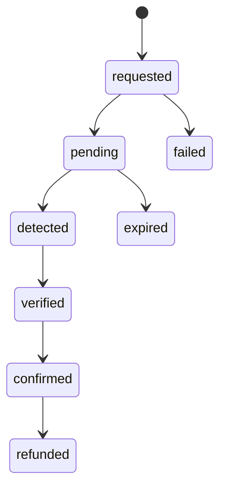

# 08 — Celo Integration

## Current implementation status

| Component | Status | Location |
|---|---|---|
| Celo JSON-RPC client | Implemented (queries a live Celo endpoint) | `freclean-payment/src/celo/celoClient.ts` |
| Supported Assets Registry | Implemented, ships empty | `freclean-payment/src/registry/assetRegistry.ts`, `freclean-api` `/api/assets` |
| Payment status lifecycle | Implemented | `freclean-api`, `freclean-payment` |
| Verification worker | Implemented (polling) | `freclean-payment/src/worker/` |
| Checkout UI | Implemented (public endpoint pending) | `freclean-dapp` |

## Payment lifecycle

No step can be skipped — enforced identically in `freclean-api`'s transition endpoint and `freclean-payment`'s verification worker.

## Verification method

FreClean verifies a Web3 payment by checking Celo directly: either confirming a customer-reported transaction hash, or scanning recent blocks for a matching ERC-20 Transfer into FreClean's treasury wallet, then waiting for a minimum confirmation count before marking the payment `verified`. See `freclean-payment/README.md` for the exact mechanism.

## Supported Assets Registry

The registry is empty as of this document. An asset is added only with a real, verified contract address and a verification date — `freclean-payment`'s registry code refuses to register an entry without both. This is a deliberate constraint: FreClean will not claim support for a stablecoin it has not actually verified end-to-end.
