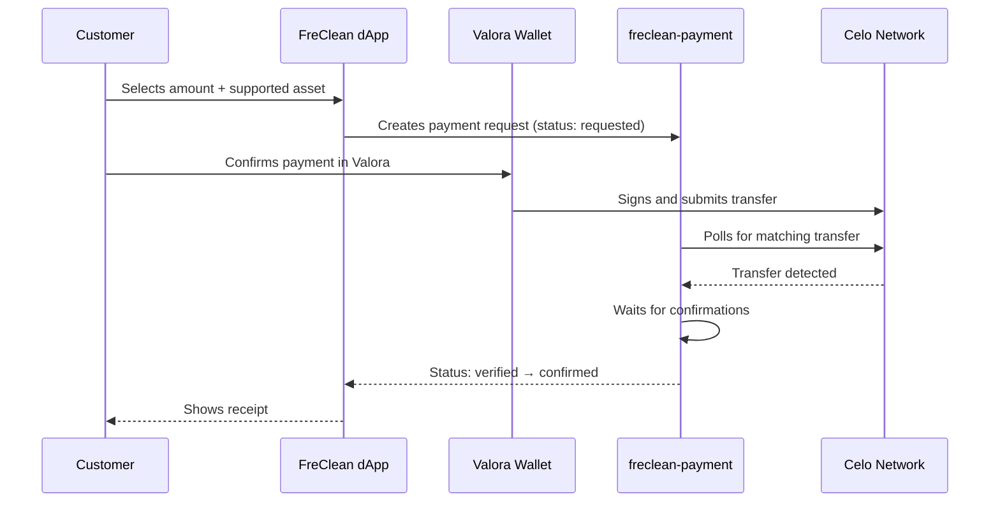

# 10 — Valora Payment Flow

## Why Valora

Valora is a mobile wallet built specifically for Celo, making it the natural first wallet FreClean supports for non-technical customers and entrepreneurs.

## Flow (as implemented today)

## Current limitation

`freclean-dapp` today only detects an already-injected wallet provider (a desktop extension or a wallet's in-app browser). The most common real Valora flow — scanning a QR code from a separate phone — requires a WalletConnect v2 session, which is not yet implemented. This is documented, not hidden, in `freclean-dapp/README.md` and `freclean-dapp/SECURITY.md`.

## What Valora never sees or sends to FreClean

FreClean never requests, stores, or transmits a private key or seed phrase at any point in this flow. Signing happens entirely inside Valora.
