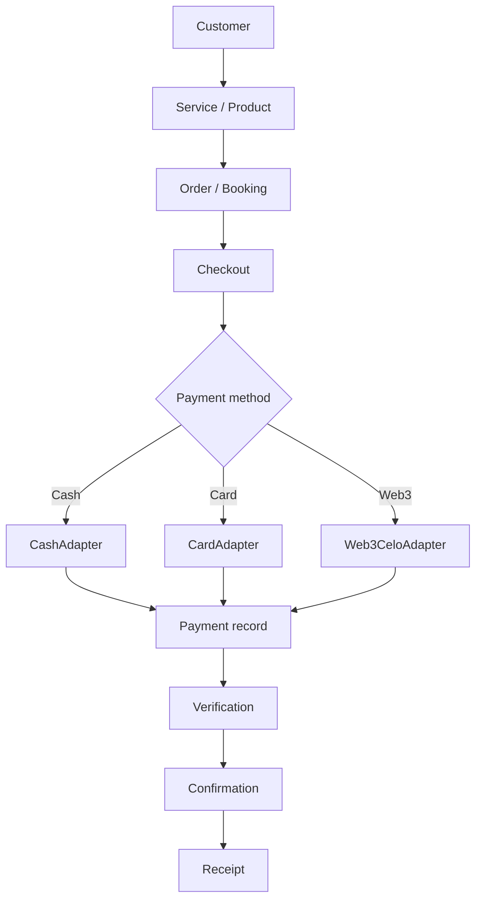

# 11 — Payment Architecture

## Unified checkout flow

## The abstraction layer

`freclean-payment` defines one `PaymentProvider` interface implemented by three adapters (cash, card, Web3), so `freclean-api`'s checkout logic never needs to know which method it's calling — see `freclean-payment/src/core/PaymentProvider.ts`. Adding a fourth payment method in the future means writing one more adapter, not rewriting checkout.

## Entities

| Entity | Purpose |
|---|---|
| `PaymentIntent` | A request to pay, before money has moved |
| `Payment` | The tracked record through its lifecycle |
| `Transaction` | A single on-chain or processor transaction backing a Payment |
| `Refund` | A refund issued against a confirmed Payment |

## Status discipline

Every payment, regardless of method, moves through the same forward-only lifecycle (`requested → pending → detected → verified → confirmed`, or a terminal failure). This is enforced in two independent places — `freclean-api`'s transition endpoint and `freclean-payment`'s verification worker — so a payment cannot be marked confirmed by skipping verification in either system.

## Extensibility

New payment methods, and new Celo assets, can be added without rewriting core checkout logic — see the adapter pattern above and the Supported Assets Registry in `08-celo-integration.md`.
