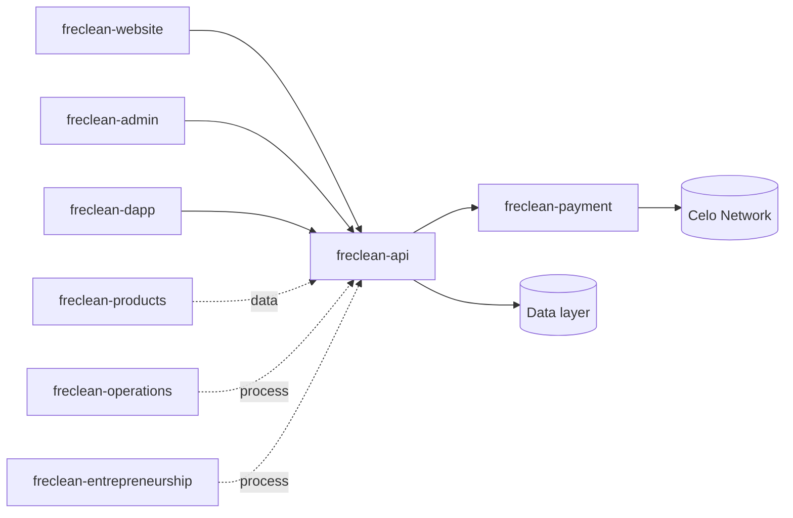

# 12 — Technical Architecture

## Repository map

## Stack summary

| Layer | Technology |
|---|---|
| Website | Static HTML/CSS |
| Admin dashboard | React + TypeScript + Vite + Tailwind |
| Web3 dApp | React + TypeScript + Vite + Tailwind |
| API | Node.js + TypeScript + Express |
| Payment layer | Node.js + TypeScript, minimal Celo JSON-RPC client |
| Data (current) | In-memory demo store, marked as such |
| Data (planned) | PostgreSQL — see `14-database-architecture.md` |

## Design principles

1. **One abstraction layer per real seam.** Payments have one (`freclean-payment`); resource CRUD has one (`freclean-api`'s `createCrudRouter`). No duplicate logic across repos.
2. **No technology adopted for its own sake.** The Celo client is hand-written JSON-RPC calls, not a full SDK, because three RPC calls didn't justify a heavy dependency — consistent with FreClean's stated engineering principle of avoiding unnecessary complexity.
3. **Every repo runnable and testable independently.** `freclean-api`, `freclean-admin`, `freclean-dapp`, and `freclean-payment` each have their own README, environment config, and (where applicable) test suite and CI.
4. **Demo data is always labeled.** Any in-memory or seed data used to make a repo runnable without external dependencies is marked `_demo: true` or explicitly commented as such — never presented as real.
