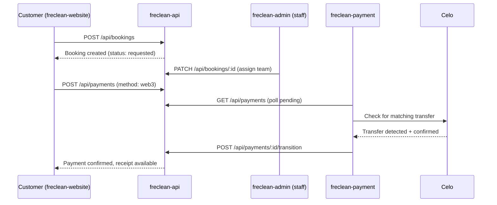

# 13 - System Architecture

## Request flow (typical booking + payment)

## Environments

| Environment | Purpose | Status |
|---|---|---|
| Local development | Each repo runnable independently against in-memory/demo data | Available today |
| Staging | Shared environment for integration testing across repos | Not yet provisioned |
| Production | Live customer-facing environment | Not yet provisioned |

## Service boundaries

- `freclean-api` owns all business data and is the single source of truth other services read from or write to.
- `freclean-payment` never writes directly to `freclean-api`'s data store - it calls the same authenticated REST endpoints any other client would, keeping the boundary honest and auditable.
- `freclean-admin` and `freclean-dapp` are pure clients of `freclean-api`; neither holds business logic that duplicates what the API enforces.
