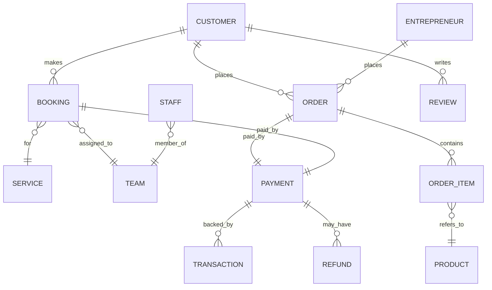

# 14 — Database Architecture

## Current state

`freclean-api` runs on an in-memory demo store (`src/data/store.ts`) so the whole ecosystem is runnable and testable without external infrastructure. This is explicitly not a production data layer — see the warning comments in that file.

## Core entities

## Planned production data layer

A relational database (PostgreSQL, tracked as the eventual `freclean-data` implementation) will replace the in-memory store. The CRUD factory pattern in `freclean-api/src/core/createCrudRouter.ts` is deliberately written so this swap changes the data access layer only — route, validation, and RBAC logic do not need to change.

## Data dictionary

A full field-by-field data dictionary is maintained per-entity in each resource's Zod schema (`freclean-api/src/modules/schemas.ts`) — kept as the single source of truth rather than duplicated here, to avoid the two going out of sync.

## Privacy by design

Customer PII (name, phone, email, address) is limited to what's needed for booking and delivery. Web3 payment records store wallet address, network, asset, and transaction hash only — never a private key or seed phrase (see `16-security-architecture.md`).
