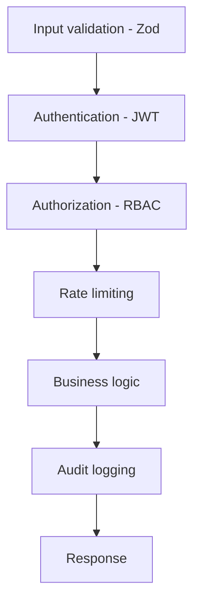

# 16 - Security Architecture

## Layered controls

## Per-repository security posture

| Repo | Key controls |
|---|---|
| `freclean-api` | JWT auth, RBAC, Zod validation, rate limiting, helmet, automatic audit log, secrets via env only |
| `freclean-payment` | No private keys ever held; HMAC-verified webhooks; forward-only status transitions enforced independently of freclean-api |
| `freclean-dapp` | No private key or seed phrase ever requested/stored; signing happens entirely in the user's wallet |
| `freclean-admin` | Role-gated routes and navigation matching freclean-api's permission model |

Each repository ships its own `SECURITY.md` with specifics and known gaps - this section summarizes, it does not replace them.

## Secrets management

No repository commits a real secret. `.env.example` files document required variables without values; `.env` is git-ignored everywhere. `freclean-payment`'s worker token and CeloHT webhook secret, and `freclean-api`'s JWT secret, must be generated and stored outside version control before any deployment.

## Known gaps (tracked, not hidden)

- No dependency vulnerability scanning in CI yet (tracked in `freclean-api`'s roadmap).
- No WalletConnect session support yet in `freclean-dapp` (tracked in that repo's README).
- No production data layer yet (`freclean-api` runs on an in-memory store) - see `14-database-architecture.md`.
- No CSP headers configured at the hosting layer yet.

Publishing known gaps openly is a deliberate choice - see the realism principle in `24-legal-policy-framework.md`.
